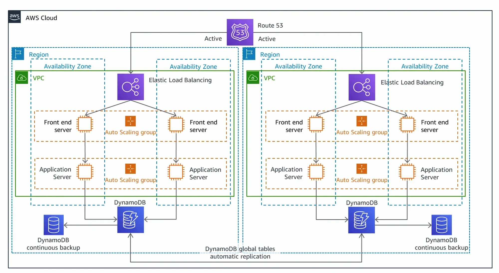

# Terraform Three-Tier Architecture Setup

This repository contains a Terraform configuration for deploying a **three-tier architecture** on AWS. The three-tier architecture separates the system into three layers:

1. **Web Tier (Frontend)** - The public-facing layer of the application, usually consisting of a load balancer and web servers.
2. **Application Tier (Middle Tier)** - The backend layer where the business logic resides, often involving API servers, application services, etc.
3. **Database Tier (Backend)** - The data storage layer, consisting of databases like RDS or NoSQL databases.

## Architecture Overview

This Terraform configuration automates the setup of the following components in a three-tier architecture:

### 1. **VPC (Virtual Private Cloud)**

- A custom VPC is created with CIDR block `10.0.0.0/16`.
- It includes both **public subnets** (for the web tier) and **private subnets** (for the application and database tiers).

### 2. **Public Subnet (Web Tier)**

- **Elastic Load Balancer (ELB)**: An **Application Load Balancer** (ALB) is deployed to distribute incoming traffic across web servers.
- The **public subnets** allow for internet-facing resources like the ALB to interact with clients.

### 3. **Private Subnet (Application Tier)**

- The **application tier** typically includes API servers, application logic, and other backend components.
- The **private subnets** are used to host these resources for enhanced security.
- These subnets do not have direct access to the internet but can interact with the public subnets through routing.

### 4. **Database Tier**

- An **RDS instance** (Relational Database Service) is deployed in the private subnet to handle all database operations.
- CloudWatch logs are enabled for monitoring the RDS instance, providing visibility into database performance.

### 5. **Security Groups and IAM Roles**

- **Security Groups**: Different security groups are configured for the **web**, **application**, and **database** layers to control inbound and outbound traffic.
- **IAM Role for RDS**: An IAM role is created to allow the RDS instance to push logs to CloudWatch.

## Features

- **VPC and Subnets**: A custom VPC with public and private subnets for different tiers (web, application, and database).
- **Load Balancer**: An **Application Load Balancer** (ALB) to distribute traffic to the web tier (frontend).
- **RDS Database**: A PostgreSQL database running in a private subnet.
- **CloudWatch Monitoring**: RDS logs are exported to **CloudWatch** for performance and health monitoring.
- **Security**: Security groups and IAM roles are set up to control traffic and permissions.

## Architecture Diagram

Here’s a high-level diagram of the architecture:


---

## Variables

### Subnet Configuration

| Variable Name    | Type | Default | Description                                                             |
| ---------------- | ---- | ------- | ----------------------------------------------------------------------- |
| `subnets_config` | List | -       | List of objects containing CIDR blocks and their public/private status. |

**Validation**: CIDR blocks must be valid.

### Database Configuration

| Variable Name    | Type   | Default                        | Description                                                              |
| ---------------- | ------ | ------------------------------ | ------------------------------------------------------------------------ |
| `project_name`   | String | `Terraform-Three-Tier-Project` | The name of the project.                                                 |
| `instance_class` | String | `db.t3.micro`                  | The instance class for the RDS instance.                                 |
| `storage_size`   | Number | 10                             | The storage size (in GB) for the RDS instance. Must be between 5 and 10. |
| `engine`         | String | `postgres-14`                  | The database engine. Supports `postgres-14` or `postgres-latest`.        |
| `credentials`    | Object | -                              | Credentials for the RDS instance, including `username` and `password`.   |

**Validation**:

- Password must be at least 8 characters long, contain at least one letter, one digit, and can include special characters: `+`, `-`, `_`, `?`.

---

## Prerequisites

- [Terraform](https://www.terraform.io/downloads.html) installed.
- [AWS CLI](https://aws.amazon.com/cli/) installed and configured with appropriate AWS credentials.
- An AWS account with the necessary permissions to create VPCs, subnets, security groups, RDS instances, IAM roles, and more.

### Configuring AWS CLI

Run the following command to configure AWS CLI:

```bash
aws configure
You will be prompted to enter:
    AWS Access Key ID
    AWS Secret Access Key
    Default region name (e.g., us-east-1)
    Default output format (optional)

```

## Setup Instructions

### 1. Clone the Repository

Clone the repository to your local machine:

```bash
git clone https://github.com/hasan-abdirahman/terraform-three-tier-architecture.git
cd terraform-three-tier-architecture

```

### 2. Configure Variables

Create a terraform.tfvars file in the project root

```
subnets_config = [
   {
   cidr_block = "10.0.0.0/24"
   isPublic = true
   },
    {
   cidr_block = "10.0.0.0/24"
   },
   {
   cidr_block = "10.0.0.0/24"
   }
]
credentials = {
   username = "AKIAZAUT"
   password = "3DlCheT0OJd3d4Q4ddGy"
}

subnet_ids = []
security_group_ids = []

```

### Initalize Terraform

terraform init

### Validate Configuration

terraform validate

### Plan Deployment

terraform plan

### Apply Configuration

terraform apply
Type yes when prompted to confirm.

### Cleanup

terraform destroy
